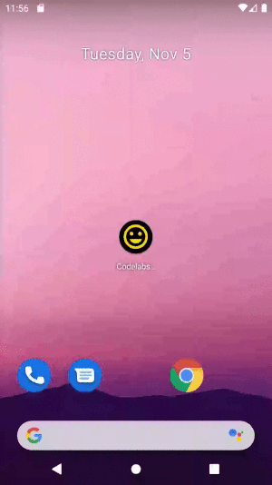

# Android fundamentals 01.4 : Learn To Help Yourself

## Introduction

Purpose is to add a launcher icon to the app.

## Task Completed 

* Where to find developer information and resources.
* How to add a launcher icon to your app.
* How to look for help when you're developing your Android apps.

# Follow on [Twitter](https://twitter.com/amansharma_dev) :bird:

## Thank You.
